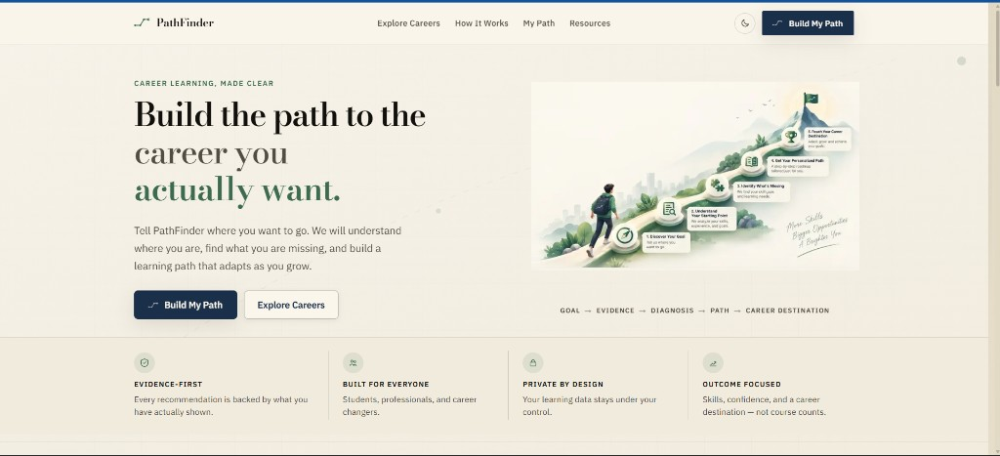
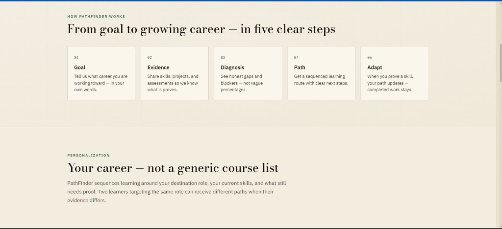
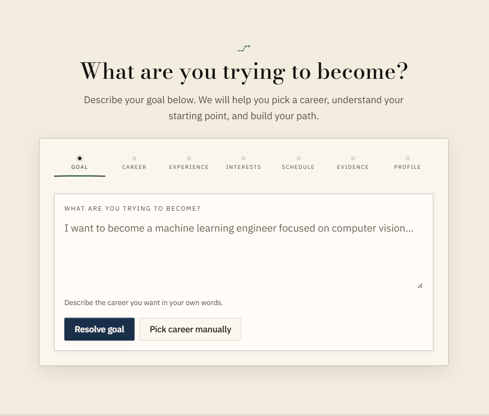

# PathFinder

**Evidence-first adaptive career intelligence** for HCLTech AMPlified Season 1 · Round 2

[](artifacts/intelligence_benchmark.json)
[](artifacts/failure-matrix/summary.json)
[](tests/)
[](frontend/)
[](artifacts/accessibility/summary-light.json)

> Not a keyword course list. PathFinder fuses self-report, assessments, and progress into a competency model where **UNKNOWN ≠ 0**, sequences resources with blocker semantics, and **adapts your path when evidence changes** — Path V1 → V2 with frozen completed work. AI **explains** verified state; it never changes scores, gaps, ranking, or sequencing.

**Repository:** https://github.com/shriansh1625/hcl_pathfinder

---

## Quick start (5 minutes)

```bash
git clone https://github.com/shriansh1625/hcl_pathfinder.git && cd hcl_pathfinder
cp .env.example .env.local && cp frontend/.env.example frontend/.env.local
docker compose up -d db
cd backend && pip install -r requirements.txt && alembic upgrade head && cd ..
python scripts/validate_ontology.py && python scripts/seed.py
cd backend && uvicorn app.main:app --port 8000          # terminal 1
cd frontend && npm install && npm run build && PORT=3002 npm run start   # terminal 2
```

Open **http://localhost:3002** → scroll to **Build My Path** → click **Judge demo (~90s)**.

> Use **`npm run build` + `next start`**, not `next dev`, for the official demo.

---

## See it in action

### Homepage — career learning, made clear

Light-theme EdTech UI with a clear value proposition and the adaptive loop at a glance.



**GOAL → EVIDENCE → DIAGNOSIS → PATH → CAREER DESTINATION**

| | |
|---|---|
| **Evidence-first** | Every recommendation backed by what you have actually shown |
| **Built for everyone** | Students, professionals, and career changers |
| **Private by design** | Your learning data stays under your control |
| **Outcome focused** | Skills, confidence, and a destination — not course counts |

---

### How it works — five clear steps

From natural-language goal to a path that adapts when you prove new skills.



| Step | What happens |
|------|----------------|
| **01 Goal** | Tell us what career you are working toward — in your own words |
| **02 Evidence** | Share skills, projects, and assessments so we know what is proven |
| **03 Diagnosis** | See honest gaps and blockers — not vague percentages |
| **04 Path** | Get a sequenced learning route with clear next steps |
| **05 Adapt** | When you prove a skill, your path updates — completed work stays |

Two learners targeting the same role can receive **different paths** when their evidence differs.

---

### Onboarding — resolve your goal in plain English

Seven-step guided intake: goal → career → experience → interests → schedule → evidence → profile.



Try: *"I want to become a machine learning engineer focused on computer vision…"* → **Resolve goal** → follow the guided flow.

---

## Verified benchmarks

| Proof | Result | Artifact |
|-------|--------|----------|
| Intelligence benchmark | **20/20** scenarios | [`artifacts/intelligence_benchmark.json`](artifacts/intelligence_benchmark.json) |
| Failure matrix (browser) | **9/9** cases | [`artifacts/failure-matrix/summary.json`](artifacts/failure-matrix/summary.json) |
| Multi-career isolation | **3/3** unique paths | [`artifacts/multi-career-proof/proof.json`](artifacts/multi-career-proof/proof.json) |
| Second-learner personalization | Same role, different evidence → different path | [`artifacts/second-learner-proof/proof.json`](artifacts/second-learner-proof/proof.json) |
| Accessibility (light + dark) | **0 critical / 0 serious** | [`artifacts/accessibility/summary-light.json`](artifacts/accessibility/summary-light.json) |
| Release smoke | **0** console / network / hydration / overflow issues | [`artifacts/release-smoke/report.json`](artifacts/release-smoke/report.json) |
| Backend tests | **237 passed**, 1 skipped | `python -m pytest -q` |
| Frontend tests | **61 passed** | `cd frontend && npm test` |

**Strongest demo moment:** complete a Skill Check → **Result** → **What changed** → **Path V2** with completed steps frozen.

<details>
<summary><strong>90-second judge demo script</strong></summary>

1. Homepage → **Build My Path** → **Judge demo (~90s)** with **AI/ML Engineer**
2. **My Journey** — gaps, evidence, next action
3. **My Path** — open WHY drawer on a resource
4. **Skill Checks** → submit → **Result**
5. **What changed** → **Path V2** (frozen completed work visible)
6. **History** timeline · **Skill Map** · **Ask PathFinder** · **Judge Mode**

Full script: [`docs/DEMO_VIDEO_SCRIPT.md`](docs/DEMO_VIDEO_SCRIPT.md)

</details>

---

## Why PathFinder is different

| Typical recommender | PathFinder |
|---------------------|------------|
| Keyword course lists | Fixed career **ontology** (8 roles, 47 skills, 62 resources) |
| "You are 40% ready" | **UNKNOWN** = no evidence yet — not 0% |
| Static playlists | **Versioned paths** with frozen completed work |
| Black-box AI picks | **Grounded AI** explains; scoring stays deterministic |
| One-size-fits-all | Same role + different evidence → **different path** |

**The adaptive loop:**

```
GOAL → CAREER → EVIDENCE → DIAGNOSIS → GAP → RECOMMENDATION → ACTION → NEW EVIDENCE → ADAPTATION
```

<details>
<summary><strong>Why this is not a demo — claim-by-claim proof</strong></summary>

| Claim | Proof |
|-------|-------|
| 8 ontology-backed careers | `data/` YAML + seed counts |
| Real NL goal intake | `/v1/intake/goal` |
| Real evidence fusion | assessments + progress + self-report |
| Role-relative diagnosis | gap engine + dashboard |
| Real recommendation engine | WHY drawer shows backend factors |
| Optional semantic ML signal | `fastembed`, 5% weight cap |
| Real assessment + progress loops | `artifacts/adaptation-proof/` |
| Immutable path versions | V1 / V2 / timeline |

</details>

---

## AI / ML architecture

```
Goal intake ──► Ontology resolution (deterministic)
                      │
Evidence fusion ◄─────┤── self-report · assessment · progress
                      │
                 Gap engine (deterministic)
                      │
         Retrieval + scoring (structured + optional semantic 5%)
                      │
                 Path sequencing + adaptation
                      │
              Grounded AI (optional explain layer)
```

| Component | Role | Calls LLM? |
|-----------|------|------------|
| Evidence fusion | Combine sources into skill levels | No |
| Gap engine | Role targets vs fused evidence | No |
| Semantic retrieval | `fastembed` local embeddings | No |
| Path + adaptation | V1→V2 versioning, frozen completions | No |
| Grounded AI | Natural-language explanations | Optional (`stub` default) |

Path generation, assessment scoring, and adaptation **never** wait on the LLM.

Full boundary: [`docs/AI_ARCHITECTURE.md`](docs/AI_ARCHITECTURE.md) · Judge Q&A: [`docs/JUDGE_FAQ.md`](docs/JUDGE_FAQ.md)

---

## Project structure

```
frontend/     Next.js 15 — production UI (light theme default)
backend/      FastAPI + SQLAlchemy + Alembic
data/         YAML ontology (source of truth)
docs/         Architecture, submission package, reproducibility
scripts/      seed, benchmark, browser QA
tests/        pytest + vitest
```

See [`docs/ARCHITECTURE.md`](docs/ARCHITECTURE.md) and [`docs/DATA_MODEL.md`](docs/DATA_MODEL.md).

<details>
<summary><strong>Detailed setup & environment variables</strong></summary>

### Requirements

Python 3.11+, Node.js 20+, Docker Desktop

### Database + seed

```bash
cp .env.example .env.local
cp frontend/.env.example frontend/.env.local

docker compose up -d db
cd backend && pip install -r requirements.txt && alembic upgrade head && cd ..
python scripts/validate_ontology.py && python scripts/seed.py
```

Expected: `Seed complete: 47 skills, 8 roles, 58 relationships, 62 resources, 4 assessments.`

### Backend

```bash
cd backend && uvicorn app.main:app --host 0.0.0.0 --port 8000
```

### Frontend (production demo)

```bash
cd frontend && npm install && npm run build && PORT=3002 npm run start
```

### Environment variables

| Variable | Purpose |
|----------|---------|
| `DATABASE_URL` | PostgreSQL (see `.env.example`) |
| `PATHFINDER_CORS_ORIGINS` | Comma-separated frontend origins |
| `NEXT_PUBLIC_API_URL` | API base for Next.js rewrites (**required** for build) |
| `PATHFINDER_AI_API_KEY` | Optional LLM key — never commit |
| `PATHFINDER_SEMANTIC_ENABLED` | Local `fastembed` relevance (optional) |

Copy `.env.example` → `.env.local` only. **Do not** commit `.env.local`.

Full guide: [`docs/REPRODUCIBILITY_DEPLOYMENT.md`](docs/REPRODUCIBILITY_DEPLOYMENT.md) · Cloud deploy: [`docs/DEPLOY_VERCEL_RENDER.md`](docs/DEPLOY_VERCEL_RENDER.md)

</details>

<details>
<summary><strong>More screenshots (workspace, adaptation, skill map)</strong></summary>

| Screen | Artifact |
|--------|----------|
| Dashboard | `artifacts/submission-screenshots/05-dashboard.png` |
| My Path + WHY drawer | `artifacts/submission-screenshots/07-path.png` |
| Skill Check → Result | `artifacts/submission-screenshots/10-assessment.png` → `11-result.png` |
| Path V2 after adaptation | `artifacts/submission-screenshots/13-path-v2.png` |
| Career explorer | `artifacts/submission-screenshots/03-career-explorer.png` |

Full index: [`docs/SUBMISSION_SCREENSHOT_INDEX.md`](docs/SUBMISSION_SCREENSHOT_INDEX.md)

</details>

---

## HCLTech submission package

| Document | Purpose |
|----------|---------|
| [`docs/HCLTECH_FINAL_SOLUTION_DOCUMENT.md`](docs/HCLTECH_FINAL_SOLUTION_DOCUMENT.md) | Master solution doc |
| [`docs/HCLTECH_FINAL_SUBMISSION_REPORT.md`](docs/HCLTECH_FINAL_SUBMISSION_REPORT.md) | Submission report + scorecard |
| [`docs/HCLTECH_FORM_ANSWERS.md`](docs/HCLTECH_FORM_ANSWERS.md) | Copy-paste form fields |
| [`docs/JUDGE_FAQ.md`](docs/JUDGE_FAQ.md) | Hostile-judge Q&A (30+ questions) |
| [`docs/pdf/`](docs/pdf/) | Export-ready PDFs (solution doc, pitch deck, demo script) |

---

## Known limitations

- No verified public hosted demo URL in this repo — run locally per Quick start
- Grounded LLM requires `PATHFINDER_AI_API_KEY`; CI and default use **stub** fallback
- Mobile homepage nav is compact (logo + theme toggle); desktop nav is full

---

## Security

- `.env.local` gitignored · no API keys in source or committed artifacts
- AI credentials via `PATHFINDER_AI_API_KEY` only

---

## License

MIT — see [`LICENSE`](LICENSE).
