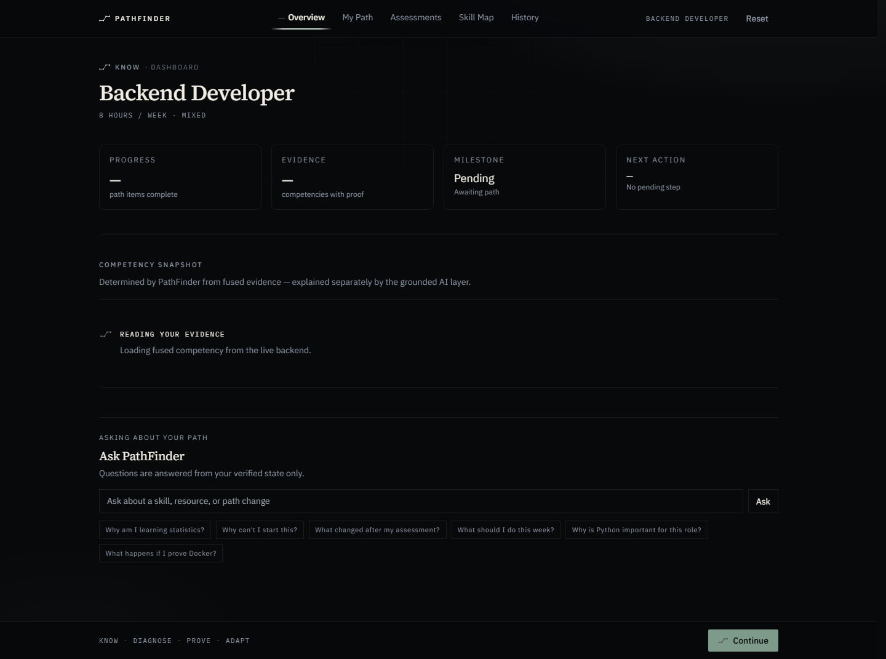
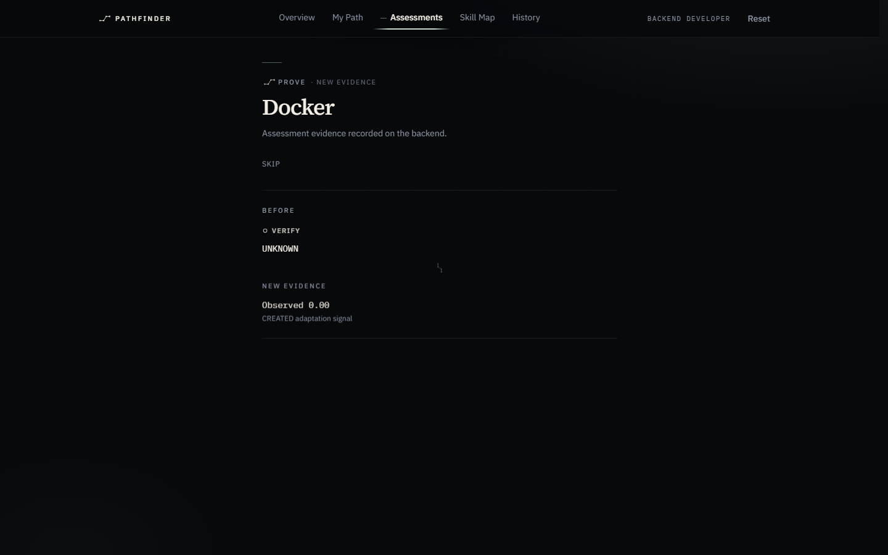
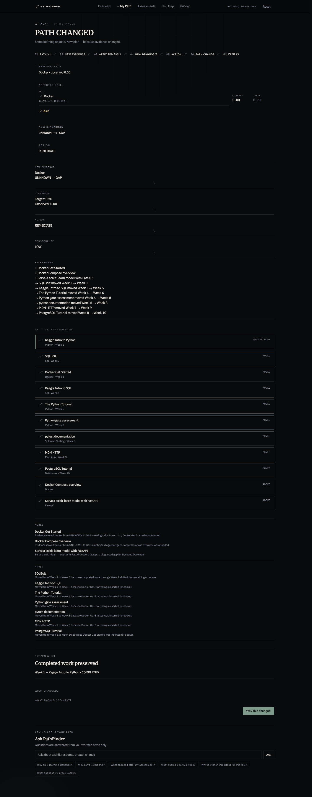

# PathFinder

## Evidence → Diagnosis → Adaptation

**PathFinder does not merely recommend courses.** It diagnoses a learner against a target career using fused evidence, builds a dependency-aware learning route, and **changes that route when new evidence changes the diagnosis.**

PathFinder turns a natural-language career goal into a versioned path, verifies skills through assessments and progress feedback, and produces a visible **Path V1 → V2** moment when the diagnosis shifts. The LLM explains grounded facts; it **cannot** rewrite proficiency, gaps, ranking, eligibility, or sequencing.

> **HCLTech AMPlified Season 1 · Round 2**



---

## Why PathFinder is different

| Typical recommender | PathFinder |
|---------------------|------------|
| Keyword course lists | Fixed career **ontology** (8 roles, 47 skills) |
| “You are 40% ready” | **UNKNOWN** = no evidence yet — not 0% |
| Static playlists | **Versioned paths** with frozen completed work |
| Black-box AI picks | **Grounded AI** explains; scoring stays deterministic |
| One-size-fits-all | Same role + different evidence → **different path** |

**The adaptive loop:** GOAL → CAREER → EVIDENCE → DIAGNOSIS → GAP → RECOMMENDATION → ACTION → NEW EVIDENCE → **ADAPTATION**



---

## Why this is not a demo

| Claim | Proof |
|-------|-------|
| 8 ontology-backed careers | `data/` YAML + seed counts |
| Real NL goal intake | `/v1/intake/goal` |
| Real evidence fusion | assessments + progress + self-report |
| Role-relative diagnosis | gap engine + dashboard |
| Real recommendation engine | WHY drawer shows backend factors |
| Optional semantic ML signal | `fastembed`, 5% weight cap |
| Real assessment + progress loops | adaptation-proof artifacts |
| Immutable path versions | V1 / V2 / timeline |
| Multi-career isolation | `artifacts/multi-career-proof/proof.json` |
| Second-learner personalization | `artifacts/second-learner-proof/proof.json` |
| 20/20 intelligence benchmark | `artifacts/intelligence_benchmark.json` |
| 9/9 failure matrix | `artifacts/failure-matrix/summary.json` |

---

## Problem

Career platforms recommend courses from keywords. They rarely answer:

- What am I actually missing for a **target role**?
- Why this resource **now** (not earlier)?
- What is **proven** vs still **unknown**?
- How should the path change when I pass or fail an assessment?

## Solution

PathFinder is an evidence-driven intelligence system:

1. **KNOW** — fuse self-report, assessment, and progress into a competency model
2. **DIAGNOSE** — dependency-aware gaps against a fixed ontology
3. **PROVE** — canonical assessments update evidence
4. **ADAPT** — Path V2 when diagnosis changes; V1 work stays frozen
5. **PATH** — sequenced resources with blocker semantics and forensic “why”



---

## Live adaptive loop (what we proved)

| Proof | Result | Artifact |
|-------|--------|----------|
| Failure matrix | **9/9** browser cases | `artifacts/failure-matrix/summary.json` |
| Intelligence benchmark | **20/20** | `artifacts/intelligence_benchmark.json` |
| Multi-career isolation | 3/3 unique paths | `artifacts/multi-career-proof/proof.json` |
| Second-learner personalization | same role, different evidence → different path | `artifacts/second-learner-proof/proof.json` |
| Accessibility | 0 critical / 0 serious | `artifacts/accessibility/summary.json` |
| Regression | 218 pytest · 53 vitest · build | `docs/FINAL_PROOF_CLOSURE.md` |

**Strongest demo moment:** complete an assessment → see Result → open **What changed** → Path V2 with completed steps frozen and new sequence ahead.

---

## AI / ML architecture

```
Goal intake ──► Ontology resolution (deterministic)
                      │
Evidence fusion ◄─────┤── self-report · assessment · progress
                      │
                 Gap engine (deterministic)
                      │
         Retrieval + scoring (structured + optional semantic 5%)
                      │
                 Path sequencing + adaptation
                      │
              Grounded AI (optional explain layer)
```

| Component | Role | Calls LLM? |
|-----------|------|------------|
| Evidence fusion | Combine sources into skill levels | No |
| Gap engine | Role targets vs fused evidence | No |
| Semantic retrieval | `fastembed` local embeddings | No |
| Path + adaptation | V1→V2 versioning, frozen completions | No |
| Grounded AI | Natural-language explanations | Optional (`stub` default) |

Path generation, assessment scoring, and adaptation **never** wait on the LLM.

**Verified facts → Grounded AI → Explanation.** The LLM cannot change proficiency, gaps, ranking, eligibility, sequencing, scoring, or adaptation.

Full judge Q&A: [`docs/JUDGE_FAQ.md`](docs/JUDGE_FAQ.md)

---

## Screenshots

| Screen | Desktop |
|--------|---------|
| Onboarding | `artifacts/submission-screenshots/01-onboarding.png` |
| Career explorer | `artifacts/submission-screenshots/03-career-explorer.png` |
| Dashboard | `artifacts/submission-screenshots/05-dashboard.png` |
| Path + blockers | `artifacts/submission-screenshots/07-path.png` |
| Assessment → Result | `artifacts/submission-screenshots/10-assessment.png` → `11-result.png` |
| Path V2 + why changed | `artifacts/submission-screenshots/13-path-v2.png` |

Regenerate: `scripts/grok_final_capture.mjs` against `next start` (production).

---

## Architecture

```
frontend/     Next.js 15 — production UI
backend/      FastAPI + SQLAlchemy + Alembic
data/         YAML ontology (source of truth)
docs/         Architecture, proof closure, reproducibility
scripts/      seed, benchmark, browser QA
tests/         pytest + vitest
```

See `docs/ARCHITECTURE.md` and `docs/DATA_MODEL.md`.

---

## Setup (fresh machine)

**Requirements:** Python 3.11+, Node 20+, Docker.

```bash
cp .env.example .env.local
cp frontend/.env.example frontend/.env.local

docker compose up -d db
cd backend && pip install -r requirements.txt && alembic upgrade head && cd ..
python scripts/validate_ontology.py && python scripts/seed.py
```

Expected: `Seed complete: 47 skills, 8 roles, 58 relationships, 62 resources, 4 assessments.`

### Backend

```bash
cd backend && uvicorn app.main:app --host 0.0.0.0 --port 8000
```

### Frontend — official production demo

```bash
cd frontend && npm install && npm run build && PORT=3002 npm run start
```

> Judges: use **`npm run build` + `next start`**, not `next dev`.

Full reproducibility guide: `docs/REPRODUCIBILITY_DEPLOYMENT.md`

**Cloud deploy (Render + Vercel):** `docs/DEPLOY_VERCEL_RENDER.md` — includes Groq `openai/gpt-oss-120b` and `render.yaml` blueprint.

---

## Environment variables

| Variable | Purpose |
|----------|---------|
| `DATABASE_URL` | PostgreSQL (see `.env.example`; Docker maps host port in `docker-compose.yml`) |
| `PATHFINDER_CORS_ORIGINS` | Comma-separated frontend origins |
| `NEXT_PUBLIC_API_URL` | API base for Next.js rewrites (**required** for build) |
| `PATHFINDER_AI_API_KEY` | Optional LLM key — never commit |
| `PATHFINDER_SEMANTIC_ENABLED` | Local `fastembed` relevance (optional) |

Copy `.env.example` → `.env.local` only. **Do not** commit `.env.local`.

---

## Production demo (90 seconds)

1. Onboarding → **Judge demo (~90s)** with **AI/ML Engineer**
2. **Dashboard** — gaps, evidence, next action
3. **My Path** — open WHY drawer on a resource
4. **Assessments** → submit → **Result**
5. **What changed** → **Path V2** (frozen completed work visible)
6. **History** timeline · **Skill Map** · **Ask PathFinder** · **Judge Mode**

---

## Judge FAQ

Short answers above; full hostile-judge Q&A in [`docs/JUDGE_FAQ.md`](docs/JUDGE_FAQ.md). Submission report: [`docs/FINAL_SUBMISSION_REPORT.md`](docs/FINAL_SUBMISSION_REPORT.md).

---

## Known limitations

- No permanent hosted demo — run locally per Setup (production `next start`)
- Grounded LLM requires `PATHFINDER_AI_API_KEY`; CI and default use **stub** fallback
- Mobile path uses a compact route compass; desktop is the full spatial composition
- GitHub repo topics/description may need manual setup if `gh` CLI is unavailable

---

## Tests & benchmark

```bash
python -m pytest -q                    # 218 passed
cd frontend && npm test                # 53 passed
cd frontend && npm run build
python scripts/intelligence_benchmark.py  # 20/20
PATHFINDER_API_URL=http://127.0.0.1:8000 python scripts/api_smoke_test.py
```

---

## Security

- `.env.local` gitignored · no API keys in source or committed artifacts
- AI credentials via `PATHFINDER_AI_API_KEY` only

---

## License

MIT — see [`LICENSE`](LICENSE).

## Project context

Clean-room Round 2 product for HCLTech AMPlified. Ontology and intelligence semantics are frozen; UI and QA harnesses document reproducibility without changing deterministic engines.
